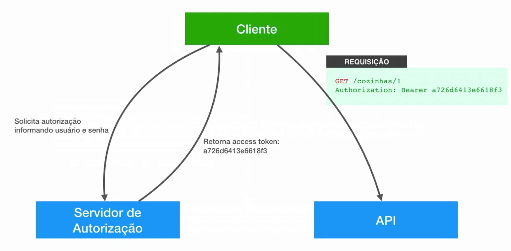

# DS_ifood

Seja bem-vindo ao meu projeto DS_iFood! Sinta-se à vontade para explorar o repositório e mergulhar no incrível mundo do Spring Boot. Meu nome é Kaique e sou um entusiasta apaixonado por programação. Fico muito feliz em te ver por aqui.

## 1 Introdução sobre o projeto

Este projeto é um mini sistema baseado no iFood e tem como objetivo me ajudar  a aplicar todo o conhecimento que adquiri. Nele, utilizo as técnicas e tecnologias mais modernas e amplamente empregadas no mercado atual.

### técnicas e tecnologias

- 1.1  Spring e Injeção de Dependências
- 1.2  JPA e Hibernate
- 1.3  REST com Spring
- 1.4  Tratamento e modelagem de erros da API
- 1.5  Validações com Bean Validation
- 1.6  Explorando mais do JPA e Hibernate
- 1.7  Testes unitario
- 1.8  Boas práticas e técnicas para APIs
- 1.9  Modelagem avançada e implementação da API
- 1.10 Upload e download de arquivos
- 1.11 E-mails transacionais
- 1.12 Documentação da API com OpenAPI, Swagger
- 1.13 Discoverability e HATEOAS A Glória do REST
- 1.14 Evoluindo e versionando a API
- 1.16 Segurança com Spring Security e OAuth2
- 1.17 OAuth2 avançado com JWT e controle de acesso

#### 1.1. Spring e Injeção de Dependências

Spring é um framework popular para desenvolvimento de aplicações Java. Uma de suas principais funcionalidades é a Injeção de Dependências (DI - Dependency Injection).

A DI é um padrão de design que promove a inversão de controle (IoC). Em vez de criar dependências diretamente, os objetos recebem essas dependências de uma entidade externa. No Spring, isso é gerenciado pelo contêiner de IoC.

##### 1.1.0 Os benefícios da DI incluem:

- Facilidade de Teste: Permite substituir dependências por mocks.
- Flexibilidade: Facilita a troca de implementações.
- Manutenção: Reduz o acoplamento, tornando o código mais modular.

#### 1.2  JPA e Hibernate

JPA (Java Persistence API) é uma especificação da Java EE que define como os dados devem ser persistidos em bancos de dados relacionais. Ele oferece uma interface padrão para mapeamento objeto-relacional (ORM), permitindo que desenvolvedores trabalhem com dados de forma orientada a objetos, sem precisar escrever código SQL diretamente.

Hibernate é uma implementação popular do JPA. Ele fornece um framework robusto para ORM, facilitando a manipulação de dados em Java. O Hibernate cuida automaticamente das tarefas de persistência e recuperação de dados do banco de dados, além de fornecer recursos adicionais, como cache de segundo nível, lazy loading e suporte a consultas HQL (Hibernate Query Language).

Em resumo, JPA é a especificação e o Hibernate é uma das implementações dessa especificação, que facilita a interação com bancos de dados em aplicações Java.

#### 1.3  REST com Spring

REST com Spring permite criar APIs web que utilizam HTTP para comunicação. Usando anotações como @RestController, @GetMapping, @PostMapping, entre outras, você define endpoints que manipulam solicitações HTTP. Spring Boot simplifica a configuração e execução da aplicação, facilitando a criação de serviços RESTful de forma rápida e eficiente.

#### 1.4  Tratamento e modelagem de erros da API

Para tratar e modelar erros em uma API REST com Spring, você pode usar @ControllerAdvice para centralizar o tratamento de exceções, criando respostas de erro padronizadas. Crie exceções personalizadas para diferentes tipos de erros e use uma classe de resposta de erro para formatar as mensagens de erro. Isso garante que a API retorne respostas de erro consistentes e informativas.

> **exemplo de uso** 

```java
@ControllerAdvice
public class ApiExceptionHandler extends ResponseEntityExceptionHandler {

	@ExceptionHandler(Exception.class)
	public ResponseEntity<?> trataException(Exception ex , WebRequest request) {
		
		ApiErro erro =  ApiErro.builder()
				.timestamp(OffsetDateTime.now())
				.Status(HttpStatus.INTERNAL_SERVER_ERROR.value())
				.type(ProblemType.ERRO_DE_SISTEMA.getUrl())
				.title(ProblemType.ERRO_DE_SISTEMA.getTitle())
				.detail("Desculpe, encontramos um problema inesperado em nosso sistema. Por favor, tente novamente e, "
						+ "se o erro persistir, entre em contato com o nosso suporte técnico para obter assistência.")
				.build();
		
		return handleExceptionInternal(ex, erro , new HttpHeaders(), HttpStatus.INTERNAL_SERVER_ERROR, request);
	}
}
	
```
#### 1.5 Validações com Bean Validation

Bean Validation, integrado ao Spring, facilita a validação de dados de entrada. Você usa anotações para definir regras de validação diretamente nas classes do modelo. Aqui está um exemplo curto:

> **exemplo de uso**
```java
@Getter
@Setter
public class CidadeDtoRequest {

    // Garante que o campo não seja nulo, vazio ou composto apenas de espaços em branco.
    @NotBlank
    private String nome;
    
    // Garante que o objeto 'estado' não seja nulo e também valida suas propriedades.
    @Valid
    @NotNull
    private EstadoDtoRef estado;
 }
```

#### 1.6  Explorando mais do JPA e Hibernate
join fetch no jpql serve para que apenas uma consulta seja feita retornando todos os relacionamentos de uma só vez, ao contrário da consulta sem o fetch que faz vários selects separadamente.

> **Exemplo de output sem o join fetch em get /pedidos**


> **Exemplo de output com join fetch em jpql.**
```java
	@Query("from Pedido pedido "  
     + "join fetch pedido.usuarioCliente "
		 + "join fetch pedido.restaurante restaurante "
		 + "join fetch restaurante.cozinha ")
	List<Pedido> buscarTodosResumido();
```


#### 1.7  Testes unitario

Testes unitários são fundamentais para garantir a qualidade do código, pois validam o comportamento individual de cada parte do software de forma controlada e automatizada. Eles são uma parte essencial da prática de desenvolvimento ágil e contribuem significativamente para a confiabilidade e manutenibilidade de sistemas de software complexos.

> **Exemplo de um teste unitario.**

```java
@ExtendWith(SpringExtension.class)
public class FluxoPedidoServiceTest {

    @InjectMocks
    private FluxoPedidoService fluxoPedidoService;

    @Mock
    private EmissaoPedidoServices emissaoPedidoServices;

    private Pedido pedidoExistente;
    private String codigoExistente;
    private String codigoInexistente;

    @BeforeEach
    void setup() throws Exception {
        codigoExistente = "123456";
        codigoInexistente = "654321";

        pedidoExistente = PedidoMockFactory.createMockPedido();
        Mockito.when(emissaoPedidoServices.buscaPorCodigo(codigoExistente)).thenReturn(pedidoExistente);
        Mockito.doThrow(PedidoNaoEncontradoException.class).when(emissaoPedidoServices).buscaPorCodigo(codigoInexistente);
    }

    @Test
    public void confirmadoDeveConfirmarPedidoQueTenhaCodigoExistente() {
        fluxoPedidoService.confirmado(codigoExistente);

        assertTrue(pedidoExistente.getStatusPedido() == StatusPedido.CONFIRMADO);
    }
}
```
> **explicação**.

O teste confirmadoDeveConfirmarPedidoQueTenhaCodigoExistente verifica se o método confirmado da classe FluxoPedidoService confirma corretamente um pedido existente com base em seu código. Aqui está uma explicação curta do teste:

- 1.7.1 Setup (setup method): Configura o ambiente de teste, inicializando variáveis e mockando o comportamento do serviço emissaoPedidoServices. O método buscaPorCodigo retorna um pedido existente para o código codigoExistente e lança uma exceção PedidoNaoEncontradoException para o código codigoInexistente.

- 1.7.2 Test (confirmadoDeveConfirmarPedidoQueTenhaCodigoExistente): Invoca o método confirmado do fluxoPedidoService com o código codigoExistente. Em seguida, verifica se o status do pedido retornado é CONFIRMADO, assegurando que o método confirmado funciona corretamente para pedidos que existem no sistema.

O objetivo é garantir que o método confirmado da classe FluxoPedidoService corretamente confirma o status de um pedido existente quando o código é válido.

#### 1.8  Boas práticas e técnicas para APIs

@Transactional: Essa anotação do sprint (org.springframework.transaction.annotation.Transactional) faz com que seja aberta uma transação na base de dados sempre que um método que manipula dados for chamado, a implementação do Spring Data JPA que é a classe SimpleJpaRepository já tem as operações como save, delete, update marcadas com @Transactional, porém como boa prática é interessante marcar os métodos dos nossos services que manipulam dados na base também, assim garantimos que não haja inconstência nos dados caso dê algúm problema e uma das operações e precise ser feito um rollback.
Com a anotação, é aberta uma transação no momento da chamada do método no service por exemplo, e não apenas quando for para o repository, o spring data JPA gerencia essas transações e executa na base de dados de acordo com a fila de gerenciamento de transações que ele cria.
Ao final do método é feito um commit na base de dados.
Caso queira forçar a execução pelo jpa é preciso usar um flush no método, não é um commit, é apenas a forma de fazer com que as operações sejam executadas na base.

Desserialização é de JSON para Objeto, serialização é de Objeto para JSON.

Mixim é uma classe que possui propriedades de uma outra classe original onde podem ser colocadas anotações que queremos deixar separadas da classe original para que fique mais coeso, como por exemplo anotações Jackson que são referêntes à API em classes de domínio, o ideal é colocar as anotações Jackson em uma classe mixim. (RestauranteMixim)  

TimeZone é o fuso horário utilizado em cada região do globo terrestre de acordo com o UTC, a diferença desses horários é chamada de offset.
UTC é a referência de horário principal de onde todas as demais regiões do mundo se baseiam, coincide com o GMT.
GMT é a TimeZone da linha principal do mundo (Prime Meridian ou Meridiano de Greenwich), é onde se inicia o TimeZone com 0, países que ficam à esqueda (Oeste) tem seus TimeZone's diminuídos em horas e países à direita (Leste) tem seus TimeZone's acrescidos em horas.


1.8.1 - Usar ISO-8601 para formatar data/hora, é um padrão bem definido de representação de datas e horas, evitando problemas principalmente quando existem TimeZones diferentes envolvidos na API. 
ex: 2020-11-05T06:40:30Z, com o Z no final significa que está exatamente no UTC, sem nenhum offset, também pode ser especificado com o offset do UTC 2020-11-05T06:41:15-03:00 (nesse caso seria o horário seis e quarenta e um usando como referência o offset de Brasilia que é menos três horas).
1.8.2 - A API deve aceitar qualquer TimeZone de entrada e converter para o TimeZone que ela está usando.
1.8.3 - Armazene Data Hora sempre em UTC sem nenhum offset.
1.8.4 - Retone a Data Hora em UTC, caso o consumidor queira mostrar em um TimeZone específico ele retorna no front.
1.8.5 - Não inclua horário se não for necessário, é permitido armazenar apenas data.
O trabalho de calcular o TimeZone geralmente é do Frontend, a api deve salvar e retornar sempre em UTC.

1.8.6 DTO - Data Transfer Object, é o padrão usado para representação dos recursos, para que fique separado das classes de domínio.
Eu posso ter mais de um DTO para representar o mesmo recurso, por exemplo, caso nesse projeto eu queira retornar um Restaurante com dados resumidos, posso criar um DTO de retorno específico para isso e um completo.

1.8.7 @Bean - Quando é injetado algum componente que não faz parte do Spring, é preciso criar uma classe de configuração e uma instância com as anotações do spring, para que fiquem disponíveis sempre que o projeto inicia, como no caso do ModelMapper.

1.8.8 Funcionamento do ModelMapper - Ele transforma todas as propriedades das classes em tokens, depois compara os tokens de origem e destino, seguindo as regras 1 - Os nomes de tokens de origem precisam ser iguais aos tokens de destino, 2 - Não importa a ordem em que os tokens estejam. 3 - O nome da propriedade de origem, deve ter ao menos um token de correspondência.
Entendendo a estratégia padrão do ModelMapper para correspondência de propriedades

https://modelmapper.org/user-manual/

~~~
<!-- http://modelmapper.org/downloads/ -->  
<dependency>   
	<groupId>org.modelmapper</groupId>  
	<artifactId>modelmapper</artifactId>  
	<version>2.3.0</version> <!-- como o parent não tem o modelmapper, preciso especificar a versão  -->  
</dependency>  
~~~

Após importar as dependências é preciso criar a classe de configuração ModelMapperBean.


SnakeCase - Usa todas as palavras em minúsculo com separação por underline ex: valor_de_frete.
No spring o padrão é lowerCammelCase, caso queira ser alterado basta adicionar em application.properties
spring.jackson.property-naming-strategy=SNAKE_CASE, porém é recomendado manter o padrão do spring pois é 
o mais comun utilizado com JSON.

#### 1.9  Modelagem avançada e implementação da API

Recurso de granularidade grossa é quando no retorno do JSON existem vários objetos aninnhados no mesmo recurso, como por exemplo, Restaurante e Endereços.
Recurso de granularidade fina é quando cada recurso representa uma parte, por exemplo um recurso /restaurates/1 retorna apenas os dados do restaurante e outro sub-recurso /restaurantes/1/endereco retorna apenas o endereco do restaurante, assim dividos cada um em um recurso.

Chatty API é uma API modelada com granularidade fina, seria Chatty (Tagarela) pelo fato de termos que fazer várias chamadas em recursos e sub-recursos nessa API.

Chunky API é uma API modelada com granulairdade grossa, Chunky (Pedaço Grande), nesse caso o consumidor da API faz todas as operações em uma única requisição, exemplo ao criar o restaurante já vai com o endereço junto no POST.

Os recursos da nossa API não necessáriamente precisam seguir os nomes dos domínios, podemos ter por exemplo um recurso chamado POST /notificacoes-restaurantes e nesse recurso passarmos um payload com um título e uma mensagem, não necessáriamente armazenando essas notificações na base, pode ser um envio de e-mail para todos os restaurantes por exemplo, e nesse caso não termos uma entidade Notificacao.

Toda vez que tem alguma alteração em uma transação com @Transactional, o JPA faz a sincronização com o banco de dados, mesmo antes do repository.save, caso não aconteça nenhuma exception na transação, ao final é feito o commit e as alterações salvas na base, mesmo sem o save do repository, se ocorrer exception é feito um rollback.
Para que o JPA não gerencie é preciso usar o método detach.

Singleton Resource é o recurso único, por exemplo quando é feita uma requisição REST em /pedidos/1

@OneToMany por default é Lazy
@ManyToOne por default é eager

cascade = CascadeType.ALL é usado para que o que for alterado em uma entidade se propague para a entidade relacionada, como por exemplo ao salvar um pedido, colocar o cascade nos itens para que os itens sejam salvos também.

Entidade Rica: Possui métodos de negócio com lógicas específicas também, como por exemplo a entidade Pedido que possui os métodos para os cálculos dos valores, transição de pedido, etc...
Entidade Anemica: Não tem nenhum método de negócio implementado.

Método de callback do JPA, é executado em alguns eventos do ciclo de vida das entidades um dos eventos é o @PrePersist, ele vai fazer com que antes de persistir a entidade esse método seja executado, como no exemplo usado em Pedido gerarCodigo().

#### 1.10 Upload e download de arquivos

Amazon S3 é o serviço de armazenamento de arquivos da amazon IAM é o serviço de gerenciador de usuários e acessos. Para acessar os arquivos no S3 é preciso associar às permissões de segurança e criar as chaves de acesso. A Amazon disponbiliza uma SDK java para gerenciamento do serviço S3, para adicionar essa SDK basta incluir as dependências dela no pom do projeto, ficam disponíveis no maven

#### 1.11 E-mails transacionais

**E-mails Transacionais:** São e-mails automáticos enviados como resposta a uma ação específica do usuário, como confirmações de pedidos, redefinições de senha ou atualizações de conta. Eles são projetados para serem altamente relevantes e oportunos, geralmente disparados por eventos específicos dentro de um sistema.

#### 1.12 Documentação da API com OpenAPI, Swagger 

Dosumentação com Open API 2 
Spring Fox gera o JSON da com as definições da API  
Swagger UI gera a renderização da documentação através do JSON em um HTML  
O que o swagger-ui faz é uma requisição no endpoint /v2/api-docs gera o JSON e através desse JSON renderiza o HTML visualmente para a documentação da API  
A configuração @Import(BeanValidatorPluginsConfiguration.class) que valida as anotações do javax validation e coloca um * vermelho na frente  
só funciona quando a propriedade não é anotada com o @ApiModelProperty, porque o @ApiModelProperty já tem um required false por default, nesse caso  
ele sobrescreve a configuração, para essas propriedades anotadas é preciso setar o required true manualmente

#### 1.13 Discoverability e HATEOAS A Glória do REST

HATEOAS Hypertext As The Engine Of Application State
Discoverability é a capacidade que a API tem de deixar que o consumidor acesse os recursos sem necessáriamente conhecer os endpoints, criando links entre os  
recursos para que possam ser navegados através da api root "/".  


Hypermedia são recursos que adicionam links para outros recursos, como no exemplo do a href em HTML.  
Também existem formatos para recursos de hypermedia no Spring, como por exemplo o Hypertext Application Language HAL  
[documentação](https://stateless.group/hal_specification.html)

#### 1.14 Evoluindo e versionando a API

O versionamento de API (API versioning) refere-se à prática de gerenciar e controlar diferentes versões de uma API oferecida por um serviço ou aplicação. Isso é feito para garantir compatibilidade entre diferentes clientes que consomem a API, enquanto permite que a API evolua ao longo do tempo com novos recursos, correções de bugs e melhorias.

> Existem várias abordagens para versionar APIs:

- 1.14.1 **URL-based Versioning:** Inclui a versão diretamente na URL da API, por exemplo, **/api/v1/resource** e **/api/v2/resource.** É simples de implementar e entender, mas pode poluir a URL.
- 1.14.2 **Header-based Versioning:** A versão é especificada no cabeçalho da requisição HTTP (por exemplo, **Accept** ou **Custom** headers). Isso mantém a URL limpa, mas requer suporte explícito nos clientes para interpretar o cabeçalho de versão.
- 1.14.3 **Query Parameter-based Versioning:** A versão é passada como um parâmetro de consulta na URL, como **/api/resource?version=1.** É simples de implementar, mas pode ter problemas de cache e não é tão comumente utilizado.
- 1.14.3 **Media Type-based Versioning (Content Negotiation):** A versão é determinada pelo tipo de mídia especificado na requisição (**Content-Type** e **Accept headers**). Isso permite negociação automática da versão da API, mas pode ser complexo de implementar e gerenciar.

Cada abordagem tem suas vantagens e desvantagens, e a escolha depende das necessidades específicas do projeto e das melhores práticas adotadas pela equipe de desenvolvimento.

#### 1.16 Segurança com Spring Security e OAuth2

Spring Security e OAuth2 são tecnologias amplamente utilizadas para garantir a segurança de APIs e aplicações web. Aqui está uma explicação breve sobre cada um e como eles se relacionam:

> *Spring Security*


**Spring Security** é um framework poderoso e altamente configurável para autenticação e autorização em aplicações Java. Ele fornece uma camada de segurança robusta que pode ser integrada facilmente em aplicações Spring, oferecendo recursos como:

- **Autenticação:** Gerenciamento de autenticação de usuários através de diferentes métodos como formulários de login, autenticação baseada em token, autenticação por LDAP, etc.
  
- **Autorização:** Controle de acesso baseado em papéis (roles) ou permissões (permissions), permitindo definir quem pode acessar quais recursos da aplicação.
  
- **Proteção contra ataques:** Prevenção contra ataques comuns como Cross-Site Request Forgery (CSRF), Cross-Site Scripting (XSS), etc.
  
- **Integração com Spring:** Facilidade de integração com o ecossistema Spring, aproveitando conceitos como Injeção de Dependência (Dependency Injection) e configuração via anotações.

> *OAuth2*

**OAuth2** é um protocolo de autorização que permite que usuários concedam acesso limitado a recursos em um serviço HTTP para outro aplicativo sem compartilhar suas credenciais diretamente. Ele é usado principalmente para delegação de autorização e é amplamente adotado para autenticação de API, incluindo:

- **Fluxo de Autorização:** Define diferentes fluxos de autorização (**authorization grant types**) para diferentes cenários de uso, como Authorization Code Grant, Implicit Grant, Client Credentials Grant, etc.
 
- **Tokens de Acesso:** Utiliza tokens de acesso (**Access Tokens**) para autorizar solicitações subsequentes aos recursos protegidos.
  
- **Segurança e Escalabilidade:** Projetado para ser seguro, escalável e adequado para integração com diferentes tipos de clientes (**aplicações web, mobile, IoT, etc.**).
  
- **Centralização de Autorização:** Permite que os usuários controlem o acesso a seus próprios recursos sem compartilhar senhas diretamente com terceiros.

> *Relação entre Spring Security e OAuth2*

Spring Security pode ser configurado para integrar e suportar o OAuth2, fornecendo um mecanismo robusto para implementar fluxos de autenticação e autorização baseados em OAuth2 em suas aplicações Spring. Combinados, eles permitem que aplicações forneçam um controle granular sobre quem pode acessar quais recursos, enquanto também garantem a segurança dos dados e operações.

Em resumo, Spring Security lida com a autenticação e autorização dentro da aplicação, enquanto OAuth2 é utilizado para delegar e gerenciar autorizações entre aplicações de forma segura e padronizada.

#### 1.17 OAuth2 avançado com JWT e controle de acesso

OAuth2 é um protocolo de autorização que permite que aplicações obtenham acesso limitado a recursos de um servidor HTTP em nome de um proprietário de recurso. O JWT (JSON Web Token) é um padrão aberto que define uma forma compacta e autossuficiente para transmitir informações com segurança entre as partes como um objeto JSON. Integrar OAuth2 com JWT pode proporcionar um mecanismo seguro e eficiente para autenticação e autorização.

> Como Funciona

**1.17.1 Autenticação e Emissão de Token**

- O cliente solicita um token de acesso enviando suas credenciais ao servidor de autenticação.
- O servidor de autenticação verifica as credenciais e, se válidas, emite um JWT.
- O JWT contém informações (claims) sobre o usuário e a autorização, e é assinado digitalmente para garantir sua integridade.

**1.17.2 Uso do Token**

- O cliente envia o JWT com cada requisição ao servidor de recursos.
- O servidor de recursos valida o JWT verificando a assinatura e a validade do token.
- Se o JWT for válido, o servidor de recursos concede acesso aos recursos solicitados com base nas informações contidas no token.

**1.17.3 Controle de Acesso Baseado em Roles**

> Controle de Acesso Baseado em Roles


Anotando Métodos ou Controladores com **@PreAuthorize**
Para aplicar controle de acesso baseado em roles, você pode usar a anotação **@PreAuthorize** nos seus métodos de controlador. Esta anotação permite que você especifique expressões de segurança complexas baseadas nas roles ou permissões do usuário autenticado.

> Por exemplo:

- **@PreAuthorize("hasRole('ADMIN')")** permite o acesso ao método apenas para usuários com a role ADMIN.
- **@PreAuthorize("hasRole('USER')")** permite o acesso ao método apenas para usuários com a role USER.

```java
import org.springframework.security.access.prepost.PreAuthorize;
import org.springframework.web.bind.annotation.GetMapping;
import org.springframework.web.bind.annotation.RestController;

@RestController
public class MyController {

    @GetMapping("/admin")
    @PreAuthorize("hasRole('ADMIN')")
    public String adminAccess() {
        return "Access granted to admin!";
    }

    @GetMapping("/user")
    @PreAuthorize("hasRole('USER')")
    public String userAccess() {
        return "Access granted to user!";
    }
}
```
Neste exemplo acima:

- O método adminAccess só pode ser acessado por usuários que possuem a role ADMIN.
- O método userAccess só pode ser acessado por usuários que possuem a role USER.


## 2 Pré-requisitos

Antes de começar, certifique-se de ter os seguintes pré-requisitos:

- **Conhecimento básico de Spring Boot:** É recomendado ter familiaridade com o framework Spring Boot para entender melhor os exemplos e os conceitos abordados neste projeto.

- **JDK 17:** É necessário ter o JDK 17 instalado no seu sistema. Certifique-se de configurar corretamente as variáveis de ambiente `JAVA_HOME` e incluir o JDK no `PATH`.

- **STS - Spring Tool Suite:** Embora não seja obrigatório, o uso do Spring Tool Suite (STS) pode facilitar o desenvolvimento de aplicativos Spring Boot. Você pode baixar o STS em [https://spring.io/tools](https://spring.io/tools).

- **Ferramenta de Versionamento de Código:** É necessário utilizar uma ferramenta para versionar o código, como o Git. Instale o Git no seu sistema e configure-o. Você pode baixar o Git em [https://git-scm.com/](https://git-scm.com/).

- **Conta na AWS:** Você precisará de uma conta na AWS para acessar os serviços da Amazon, como o S3. Crie uma conta na AWS se ainda não tiver uma.

- **Chave de Acesso AWS S3:** Gere uma chave de acesso e uma chave secreta na AWS para usar o serviço S3. Você pode seguir as instruções em [Gerar Chaves de Acesso](https://docs.aws.amazon.com/pt_br/IAM/latest/UserGuide/id_credentials_access-keys.html) para criar essas chaves.

- **Conta no SendGrid:** Crie uma conta no SendGrid para enviar emails através do seu aplicativo Spring Boot. Você pode se inscrever em [SendGrid](https://sendgrid.com/).

- **Chave API do SendGrid:** Gere uma chave API no SendGrid para autenticar seu aplicativo. Siga as instruções em [Criar Chave API](https://docs.sendgrid.com/ui/account-and-settings/api-keys) para gerar a chave.

Depois de gerar as chaves, você deve configurá-las no seu arquivo `application.properties` ou `application.yml` da seguinte forma:

```properties
# Configurações AWS S3
aws.access_key_id=${AWS_KEY:empty}
aws.secret_access_key=${AWS_SECRET:empty}
s3.bucket=${DSCATALOG_BUCKET_NAME:empty}
s3.region=${DSCATALOG_BUCKET_REGION:sa-east-1}

# Configuração SendGrid
spring.sendgrid.api-key=${SENDGRID_API_KEY}
```
## 3 Como Baixar e Configurar o Projeto

Siga os passos abaixo para baixar e configurar o projeto em seu ambiente local:

1. **Instalar o Git:**
   Se você ainda não tem o Git instalado, baixe e instale-o a partir do site oficial: [https://git-scm.com/](https://git-scm.com/).

2. **Clonar o Repositório:**
   Abra o terminal ou prompt de comando e execute o seguinte comando para clonar o repositório do projeto:
```bash
   git clone https://github.com/kaiquesilvadev/DS_ifood.git
```

3. **Acessar o Diretório do Projeto:**
 ```bash
cd DS_ifood
```
4.  **Configurar as Variáveis de Ambiente:**

Abra o arquivo **application.properties** ou **application.yml** localizado em src/main/resources.
Adicione as seguintes configurações da AWS e SendGrid, substituindo os valores com as chaves que você gerou anteriormente:
```properties
# Configurações AWS S3
aws.access_key_id=${AWS_KEY:empty}
aws.secret_access_key=${AWS_SECRET:empty}
s3.bucket=${DSCATALOG_BUCKET_NAME:empty}
s3.region=${DSCATALOG_BUCKET_REGION:sa-east-1}

# Configuração SendGrid
spring.sendgrid.api-key=${SENDGRID_API_KEY}
```

5. **Importar e Executar o Projeto:**

- Abra o Spring Tool Suite (STS).
- Selecione File > Import.
- Escolha Maven > Existing Maven Projects e clique em Next.
- Navegue até o diretório onde você clonou o projeto (DS_ifood) e clique em Finish.
- No STS, clique com o botão direito do mouse no projeto e selecione Run As > Spring Boot App.

O projeto será iniciado e você poderá acessar o aplicativo conforme configurado. Certifique-se de ter todos os pré-requisitos instalados e configurados antes de iniciar o projeto.


6. 
